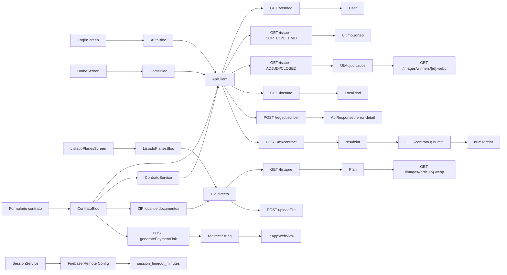

# Grafo de llamadas Artemis

## Arquitectura recuperada

La aplicación usa una arquitectura Flutter por features, con `flutter_bloc` y GoRouter. La capa de red no es uniforme:

- `ApiClient` envuelve Dio para `/vended`, `/regsubscriber`, `/locmae`, `/issue`, `/mkcontract` y `/contrato`.
- `ContratoService` sólo media el alta de suscriptor y sus errores de negocio.
- `/listapre`, `uploadFile` y `generatePaymentLink` crean Dio directamente y evitan `ApiClient`.
- No se recuperó una capa de repository de producción entre los blocs y estos clientes. El `mock_plan.dart` compilado aporta datos de skeleton/loading, no un backend alternativo.

## Vista global



## Login de productor

```text
LoginScreen
  → AuthBloc (evento Login)
    → jsonEncode(q: {numvende, activo})
    → jsonEncode(h: {columns: [...]})
    → ApiClient.get("/vended", queryParameters: {q, h})
      → Dio.get(base + path)
        → GET Artemis /vended
          → List<dynamic>
            → lista vacía: fallo local
            → response.data[0]
              → User.fromJson
                → AuthState autenticado
```

No hay endpoint de token, refresh, logout remoto ni intercambio de cookie confirmado. La sesión de navegación depende del `User` local y del control de inactividad.

## Home: sorteos y adjudicaciones

```text
HomeScreen
  → HomeBloc GetInitialData
    → ApiClient.get('/issue?q={SORTEO,ULTIMO}&h={columns:[issue_descr]}')
      → issue_descr posicional / separado por ';'
        → UltimoSorteo
          → date
          → next_draw_date
          → first_winner / second_winner / third_winner

    → ApiClient.get('/issue?q={assigned_to:6,status:CLOSED,related_project:ADJUDI}&h={...,offset:0,limit:8}')
      → List de rows
        → UltAdjudicados.fromJson
          → valores display posicionales
          → image_id
            → CachedNetworkImage
              → GET https://artemis.clubsanjorge.com.ar/images/winners/{image_id}.webp
```

Una segunda llamada idéntica de sorteo sale del flujo de contrato:

```text
InicioDelPlanScreen
  → ContratoBloc GetSorteo
    → ApiClient.get('/issue?...SORTEO...ULTIMO...')
      → issue_descr
        → selección de elemento posicional
          → replaceAll(';', ' '), trim y DateFormat
            → opciones de mes/cuota inicial
```

## Catálogo y selección de plan

```text
ListadoPlanesScreen
  → ListadoPlanesBloc
    → Dio().request(fullUrl, Options(method: GET))
      → GET /listapre q.activo=1 h.columns=[...]
        → jsonEncode(response.data)
          → json.decode(...)
            → List<Plan>.fromJson
              → filtros/orden/UI
              → GET /images/{Plan.articulo}.webp

Plan elegido
  → ContratoInitScreen / resumen
    → Plan.articulo
      → mkcontract.articulo
      → generatePaymentLink.article_id
      → URL de imagen
```

El sitio web del repositorio tiene otro consumidor independiente de `/listapre`; no forma parte de este grafo APK y usa `descsart` en lugar de `descart`.

## Alta de cliente/suscriptor

```text
ContratoDatosPersonalesDni
  → escáner de código de DNI local o carga manual
  → UserFormData

LocalidadActualSelect / LocalidadNacimientoSelect
  → ApiClient.get('/locmae?q={codprov}&h={limit:10000,columns:[...]}')
    → List<Localidad>
      → selección de codpost actual y de nacimiento

ContratoResumenDatosPersonales
  → ContratoBloc RegisterSuscriber
    → construye Map de 15 campos
      → ContratoService.registrarSuscriptor
        → ApiClient.post('/regsubscriber', data: map)
          → JSON UTF-8
            → respuesta dinámica
              → ContratoService.verificarErroresBackend
                → lista vacía: excepción
                → error == true: detail/fallback
                → otro: ApiResponse.success
```

Transformaciones importantes:

```text
dni String            → int.parse(dni + "1") → regsubscriber.numdoc
nombre + " " + apellido                    → nomsoc
fecha                  → ddMMyyyy             → fecnac
localidadActual.codpost                       → codpost
localidadNacimiento.codpost ?? 0              → lugnacim
Genero.id                                    → sexosoc
EstadoCivil.id                               → estcivil
pep radio (Sí=1/No=0)                        → pep
uif radio (Sí=1/No=0)                        → sujeobli
0                                            → acid
"ARG"                                        → naciona
```

## Documentos y contrato

```mermaid
sequenceDiagram
    participant UI as "ResumenContratoScreen"
    participant Bloc as "ContratoBloc CreateContract"
    participant Local as "Filesystem + flutter_archive"
    participant Dio as "Dio directo"
    participant Api as "ApiClient"
    participant Remote as "Servidores no contactados"

    UI->>Bloc: Crear contrato
    Bloc->>Local: Verificar frente, dorso, selfie y firma
    Bloc->>Local: Crear test1.zip (orden fijo de 4 entradas)
    Bloc->>Dio: FormData(doc_number, images=test1.zip)
    Dio--xRemote: POST /api/rest/v2/uploadFile
    Remote--xDio: Cualquier 2xx; body ignorado
    Bloc->>Api: POST /mkcontract JSON
    Api--xRemote: /mkcontract
    Remote--xApi: [{result:int}]
    Bloc->>Api: GET /contrato q.numtit="result"
    Api--xRemote: /contrato
    Remote--xApi: [{numsort:int,...}]
    Bloc-->>UI: éxito con numSorteo
```

Dependencia estricta recuperada:

```text
4 archivos locales
  → ZIP creado
  → upload completa sin DioException
  → mkcontract[0].result
  → contrato[0].numsort
  → estado de contrato exitoso
```

No hay rollback, compensación, retry explícito o idempotency key entre etapas.

## Pago

```text
ModalidadPagoDerechoSuscripcion / MercadoPagoScreen
  → ContratoBloc GeneratePaymentLink
    → Map JSON {article_id, amount, first_name, last_name,
                identification_type:"DNI", identification_number, email}
      → Dio().request(POST generatePaymentLink)
        → response.data["redirect"] as String
          → PaymentState.success(redirectUrl)
            → InAppWebView.loadUrl(redirect)
              → URL.path == ruta de éxito → pantalla éxito
              → URL.path == ruta de fallo → pantalla error
```

La comparación WebView recuperada usa la ruta, no valida estáticamente que el host del redirect sea uno esperado.

## Sesión y Remote Config

```text
App startup
  → Firebase.initializeApp
  → SessionService.initialize
    → FirebaseRemoteConfig.instance
      → setDefaults({session_timeout_minutes: 120})
      → setConfigSettings(...)
      → fetchAndActivate()
        → getInt("session_timeout_minutes")
          → timer de inactividad/sesión local
```

Remote Config afecta el tiempo de sesión, no la base Artemis ni las rutas detectadas.

## Grafo del sitio estático, separado del APK

```text
Página web de sorteos/adjudicaciones
  → assets/js/modules/data/api.js
    → carga backup local si existe
    → si no, fetchArtemisIssues
      → GET /issue SORTEO/ULTIMO
      → GET /issue ADJUDI/CLOSED (limit 16 en web)
      → GET /issue ADJUDI por issue_summary=01/MM/YYYY

Página web de catálogo
  → catalog-api.js
    → fetch GET /listapre (columns incluye descsart)
      → normalización de plan
        → fallback data/plan_catalog.json si corresponde
```

Estos call sites son reales en el código del repositorio, pero no prueban que el APK 3.3.6 los contenga ni que se hayan ejecutado durante la auditoría.

